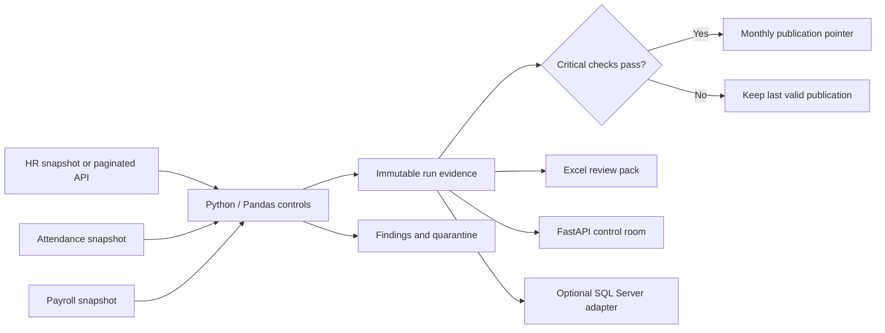

# PeopleOps Control

[](https://github.com/AmnonTamsut/peopleops-control/actions/workflows/validate.yml)

**An HR/payroll ETL portfolio tailored to Harel's HR Data Developer role.** Reconcile HR, attendance and payroll inputs, explain discrepancies, preserve run evidence and generate an Excel review pack.

Independent demonstration with synthetic employees. No Harel affiliation, real employee records or salary-payment capability.

[Sample Excel review pack](examples/peopleops-review.xlsx) · [Recorded test results](examples/test-results.txt) · [Synthetic run evidence](examples/demo-evidence.json)

## Run in two minutes

Requires Python 3.11+. Run these commands from this repository:

```bash
python -m venv .venv
source .venv/bin/activate
python -m pip install -r requirements.txt
python -m peopleops serve
```

Open **http://127.0.0.1:8000**. The server seeds July–September 2026 clean runs and a September attempt containing deliberately introduced defects. Select **Corrected** and run the pipeline to show recovery. API documentation is at **http://127.0.0.1:8000/docs**.

Windows: activate with `.venv\Scripts\activate`.

## The demonstration that matters

1. Open September's blocked run. Explain one gross variance and one invalid source row.
2. Download the Excel pack and show ownership/remediation in Exceptions and the checksum in Lineage.
3. Run the corrected snapshot. Explain why the source hash changes and a new run is created.
4. Run it again. It reuses the original run, with no duplicate facts.
5. Show SQL Server's publication procedure and explain how a blocked attempt preserves the last valid published snapshot.

## Why this fits the job

| Harel requirement | Inspectable project evidence |
|---|---|
| Python and Pandas | Multi-source joins, validation and department aggregation in `peopleops/pipeline.py` |
| SQL and MSSQL | Indexed schema, transactional publication and CTE/window analysis in `sql/` |
| End-to-end ETL | Extract → validate → reconcile → immutable load → publish → report |
| Scheduled processes | A repeatable CLI, exit codes and scheduler example in `docs/operations.md` |
| Automatic Excel reports | Four-sheet workbook generated from a specific run, with filterable evidence |
| Data reliability | Quarantine, critical gates, checksums, idempotency and last-good publication |
| APIs and system integration | FastAPI control API and a paginated HTTP HR extractor with bounded retries |
| Business/technology collaboration | Findings with responsible owner, evidence and actionable remediation |

## CLI and verification

```bash
python -m peopleops run --period 2026-09 --scenario clean
python -m peopleops run --period 2026-09 --scenario review
# Review scenario exits 2 to signal critical findings. Evidence is still saved.
python -m peopleops run --period 2026-09 --scenario corrected
python -m unittest discover -s tests -v
```

With the demo server running, exercise actual HR HTTP extraction:

```bash
python -m peopleops run --period 2026-09 --scenario clean --hr-url http://127.0.0.1:8000/mock/hr/employees
```

Reports are written to `artifacts/`; the local database and snapshots live in `data/`. Use `--data-dir` before the subcommand to isolate runs. Runtime data and reports are ignored by Git.

All **43 automated tests pass**, covering the public pipeline, concurrent reruns, HTTP API, HR extraction and Excel outputs. They use temporary databases and synthetic sources; no running server or SQL Server is required. CI installs the project dependencies, runs the suite and checks Python/JavaScript syntax. Results and execution limits are recorded in `docs/verification.md`.

## Architecture



SQLite makes the demo runnable without database infrastructure. The SQL Server schema and Python `pyodbc` adapter are a separate integration path. SQL Server has not been executed in this environment; see [SQL Server setup](docs/sql-server.md) for prerequisites and validation. The HR API adapter is executable; attendance and payroll currently use generated fixture snapshots.

See [business assumptions](docs/business-rules.md), [runbook](docs/operations.md), [interview/application material](docs/application.md), [specification](docs/spec.md) and [verification results](docs/verification.md).

## Scope

This demonstrates reconciliation controls and maintainable engineering, not production readiness or statutory Israeli payroll. Production use would require real source agreements, authentication, permissions, retention and monitoring. Understand and adapt the project before describing it as your own work in an application.
